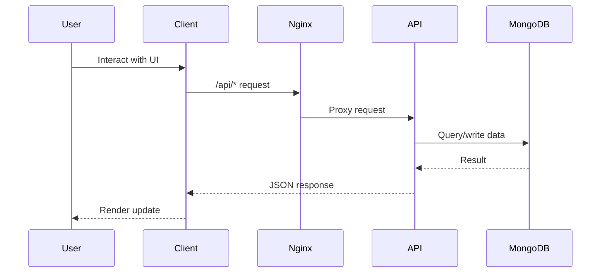
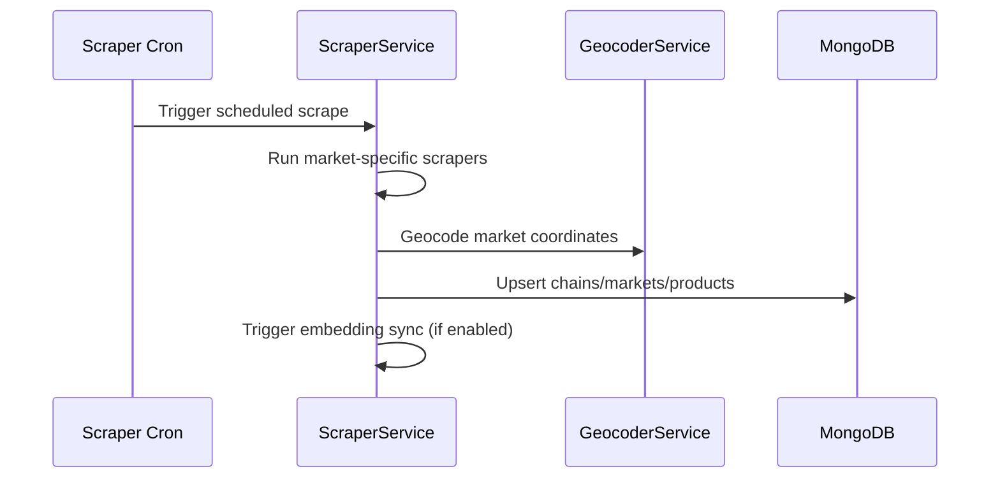
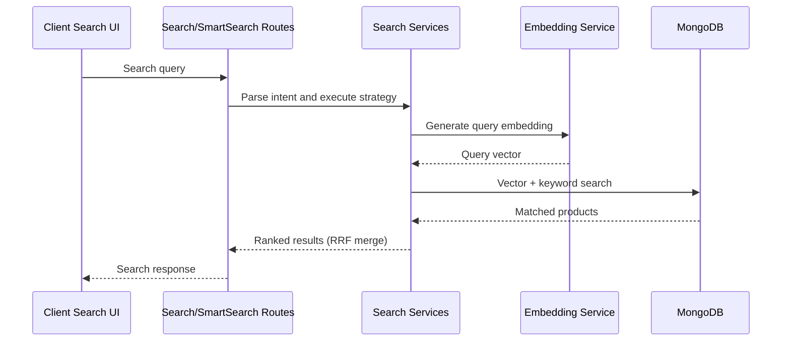

# Data And Request Flows

## Public Summary

The platform has three critical flows:

- User request flow (client to API and routing).
- Data ingestion flow (scrapers into MongoDB).
- Search enrichment flow (embeddings and smart search).

## Internal Details

### User Request Flow

### Scraper Ingestion Flow

### Search Flow

## Source Anchors

| Path | Relevance |
|------|-----------|
| `apps/server/src/modules/scraper/scraper.cron.js` | Cron trigger for ingestion flow |
| `apps/server/src/modules/scraper/scraper.service.js` | Scraper orchestration |
| `apps/server/src/modules/search/search.service.js` | Hybrid search (vector + keyword + RRF) |
| `apps/server/src/modules/search/smart-search.service.js` | Recipe and budget-aware search |
| `apps/client/src/features/map/pages/MapPage.jsx` | User-facing search and routing UI |

## Risks and Trade-offs

- Scraper reliability depends on external HTML structure stability.
- Embedding generation depends on third-party API availability and quota.
- Search quality and performance are coupled to embedding freshness.
