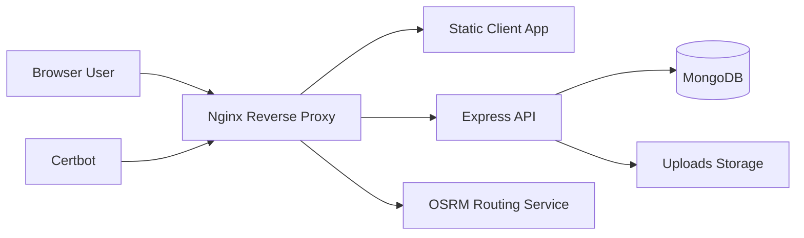
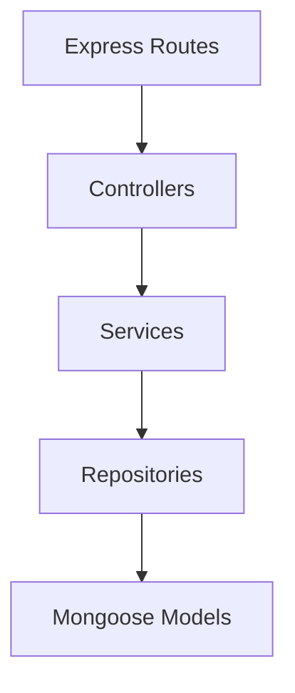
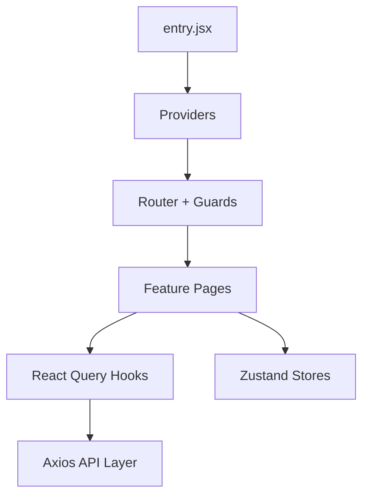

# System Architecture Overview

## Public Summary

Student Obrok is a containerized full-stack system where a React client consumes an Express API, while OSRM provides route computation and MongoDB stores application data.

## Internal Details

### Runtime Topology

### Backend Layering

### Frontend Layering

## Source Anchors

| Path | Relevance |
|------|-----------|
| `apps/server/src/app.js` | Middleware stack and route mounting |
| `apps/server/src/server.js` | Startup lifecycle and cron initialization |
| `apps/server/src/container.js` | DI composition root |
| `apps/client/src/entry.jsx` | Frontend provider chain |
| `apps/client/src/components/layout/App.jsx` | Route tree and guards |
| `docker-compose.dev.yml` | Dev service topology |
| `docker-compose.prod.yml` | Prod service topology |
| `apps/nginx/nginx.conf` | Reverse proxy and static serving |

## Risks and Trade-offs

- API and cron execution share one process, which keeps deployment simple but couples web traffic and background workload.
- Nginx currently serves SPA fallback for the app; docs hosting should use VitePress-friendly static routing rules to avoid incorrect fallback behavior.
