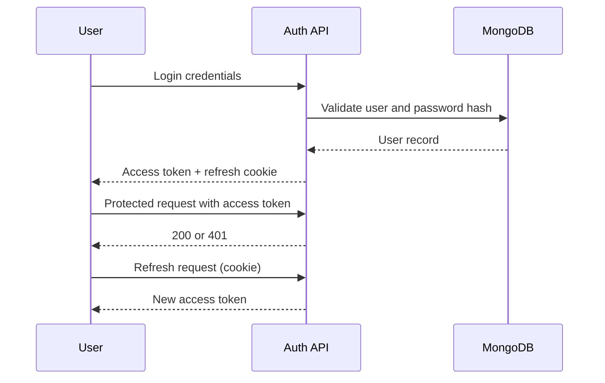

# Auth And Security

## Public Summary

Authentication uses JWT access tokens and refresh tokens with cookie transport. Core security controls include helmet headers, CORS controls, and centralized error handling.

## Internal Details

### Token Flow

### Security Controls

- Helmet enabled with production CSP behavior.
- Allowed origins enforced by CORS options.
- JWT verification middleware protects private routes.
- Error middleware converts internal failures to structured responses.

### Hardening Backlog

- Expand rate limiting beyond login.
- Add stronger upload content verification.
- Add operational alerting for abnormal auth failure patterns.

## Source Anchors

| Path | Relevance |
|------|-----------|
| `apps/server/src/modules/auth/` | Auth module (controller, service, routes, model) |
| `apps/server/src/modules/auth/middleware/` | JWT verification, admin check |
| `apps/server/src/config/corsOptions.js` | CORS origin enforcement |
| `apps/server/src/shared/middleware/errorHandler.js` | Centralized error handler |
| `apps/server/src/config/multerConfig.js` | File upload configuration |

## Risks and Trade-offs

- Refresh-token strategy balances usability and security, but multi-device token management requires strict monitoring and revocation practices.
