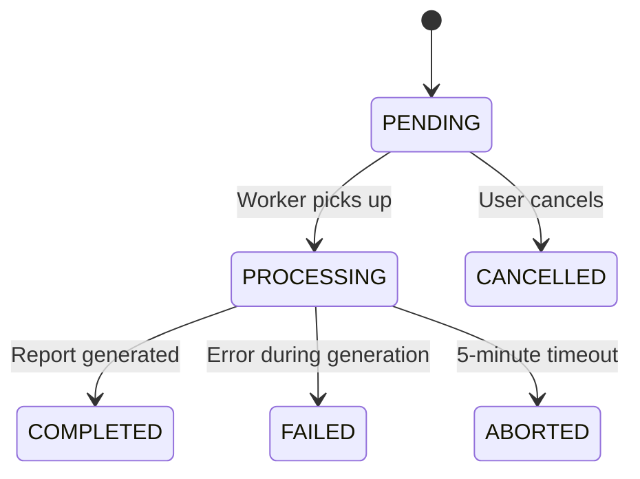

# Jobs, Cron, And Reports

## Public Summary

The API process runs scheduled jobs for scraping and analytics cleanup, and it supports asynchronous report generation with status tracking.

## Internal Details

### Scheduled Jobs

- Scraper cron: market data ingestion and optional embedding sync.
- Analytics cron: periodic retention cleanup and aggregation maintenance.

### Report Lifecycle

### Report Workflow

1. User requests report creation.
2. Job state is persisted.
3. Background processing generates output file.
4. Client polls status and downloads when completed.

## Source Anchors

| Path | Relevance |
|------|-----------|
| `apps/server/src/modules/scraper/scraper.cron.js` | Scraper schedule (Mon/Thu 03:00) |
| `apps/server/src/modules/analytics/analytics.cron.js` | Analytics cleanup (daily 02:30) |
| `apps/server/src/modules/report/report.service.js` | Job orchestration and CSV generation |
| `apps/server/src/modules/report/report.controller.js` | HTTP job lifecycle endpoints |

## Risks and Trade-offs

- In-memory active job tracking can lose transient job state on process restart.
- Long-running work in API process should be monitored to avoid request latency impact.
