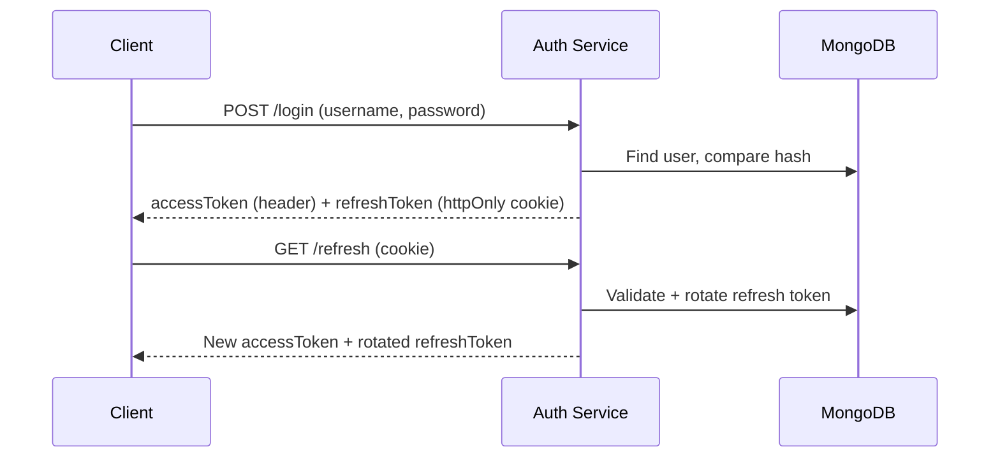

# Auth Module

## Public Summary

JWT-based authentication with secure token rotation, refresh token reuse detection, and rate-limited login.

## Internal Details

### Files

| File | Role |
|------|------|
| `auth.controller.js` | HTTP handlers for login, logout, refresh |
| `auth.service.js` | Authentication business logic |
| `auth.routes.js` | Route definitions with middleware |
| `auth.schema.js` | Zod validation schemas |
| `user.model.js` | Mongoose User schema |
| `auth.repository.js` | User data access |
| `token.service.js` | JWT sign/verify utilities |

### Endpoints

| Method | Path | Auth | Description |
|--------|------|------|-------------|
| `POST` | `/login` | Public (rate-limited) | Authenticate user |
| `GET` | `/logout` | Cookie | Clear tokens and invalidate session |
| `GET` | `/refresh` | Cookie | Rotate access token via refresh token |

### Data Model — User

```
username    : String (unique, required)
password    : String (bcrypt hash)
refreshToken: [String] — array of active refresh tokens
```

### Token Flow



### Security Controls

- **Rate limiting** on `/login` to prevent brute-force attacks.
- **Refresh token rotation**: old token is replaced on each refresh call.
- **Reuse detection**: if a previously-rotated token is presented, all tokens for that user are wiped — forces full re-login.
- **httpOnly, secure, sameSite** cookie flags on refresh tokens.

### Extension Points

- Add roles/permissions by extending the User model and `verifyAdminUser` middleware.
- Add OAuth providers by creating alternative auth strategies in the service layer.

## Source Anchors

| Path | Relevance |
|------|-----------|
| `apps/server/src/modules/auth/` | Controller, service, routes, schema, model, repository |
| `apps/server/src/modules/auth/middleware/` | verifyJWT, verifyAdminUser, optionalVerifyJWT, credentials |

## Failure Modes

| Failure | Behavior |
|---------|----------|
| Invalid credentials | 401 with generic message |
| Expired refresh token | 403, client redirects to login |
| Token reuse detected | All user tokens wiped, 403 |
| Rate limit exceeded | 429, retry after cooldown |
