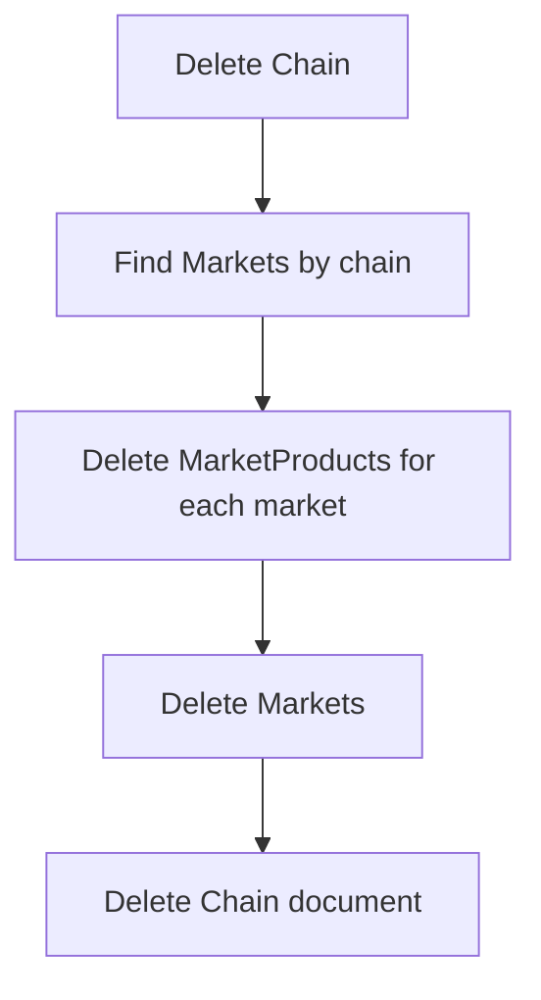

# Chain Module

## Public Summary

Manages supermarket chain entities (e.g. Vero, Ramstore) with image association and cascading relationships to markets and products.

## Internal Details

### Files

Standard CRUD layer: controller, service, routes, schema, model, repository (7 files).

### Endpoints

| Method | Path | Auth | Description |
|--------|------|------|-------------|
| `GET` | `/chains` | Public | List chains (paginated, searchable) |
| `GET` | `/chains/:id` | JWT | Get chain detail |
| `POST` | `/chains` | JWT | Create chain |
| `PUT` | `/chains/:id` | JWT | Update chain |
| `DELETE` | `/chains/:id` | JWT | Delete chain + cascade |
| `GET` | `/chains/report` | JWT | CSV report |

### Data Model — Chain

```
name  : String (unique, required)
image : ObjectId → Image (optional)
```

Virtual: `markets` — populated via Market.chain back-reference.

### Cascade Delete

Deleting a chain removes:
1. All associated **Markets** linked to the chain.
2. All **MarketProduct** junction records for those markets.



## Source Anchors

| Path | Relevance |
|------|-----------|
| `apps/server/src/modules/chain/` | Controller, service, routes, schema, model, repository |
