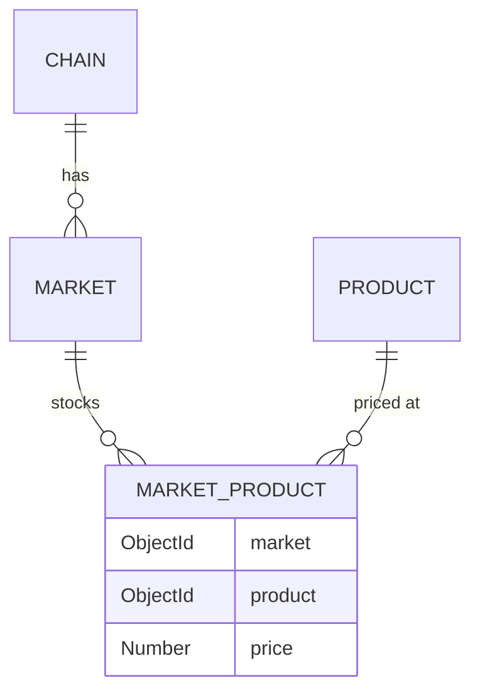

# Product Module

## Public Summary

Product catalog with multi-market pricing via a junction table. Supports category filtering, price ranges, and market-scoped queries.

## Internal Details

### Files

| File | Role |
|------|------|
| `product.controller.js` | HTTP handlers |
| `product.service.js` | Business logic |
| `product.routes.js` | Route definitions |
| `product.schema.js` | Zod validation |
| `product.model.js` | Mongoose Product schema |
| `product.repository.js` | Product data access |
| `marketProduct.model.js` | Junction table schema |
| `marketProduct.repository.js` | Junction data access |

### Endpoints

| Method | Path | Auth | Description |
|--------|------|------|-------------|
| `GET` | `/products` | Public | List products (filter by title, category, market, price range) |
| `GET` | `/products/categories` | Public | Category list (optionally scoped to market) |
| `GET` | `/products/:id` | Public | Product detail |
| `POST` | `/products` | JWT | Create product |
| `PUT` | `/products/:id` | JWT | Update product |
| `DELETE` | `/products/:id` | JWT | Delete product |

### Data Models

**Product**
```
title      : String (unique, required)
category   : String (required)
description: String
image      : ObjectId → Image (optional)
```

**MarketProduct** (junction table)
```
market  : ObjectId → Market (required)
product : ObjectId → Product (required)
price   : Number (required)
```

Unique compound index on `(market, product)` — one price per product per market.

### Many-to-Many Relationship



## Source Anchors

| Path | Relevance |
|------|-----------|
| `apps/server/src/modules/product/` | Controller, service, routes, schema, models (Product + MarketProduct) |
