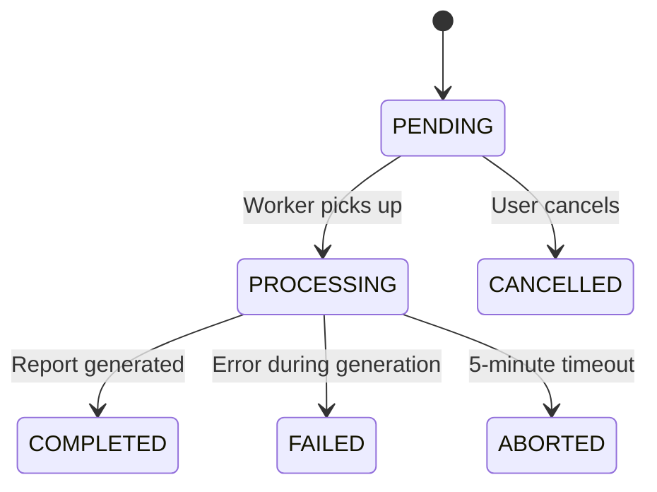

# Report Module

## Public Summary

Asynchronous report generation with a job queue, timeout enforcement, and CSV artifact download.

## Internal Details

### Files

| File | Role |
|------|------|
| `report.controller.js` | HTTP handlers for job lifecycle |
| `report.service.js` | Job orchestration and report generation |
| `report.routes.js` | Route definitions |
| `report.schema.js` | Zod validation |
| `report-job.model.js` | Job state machine schema |
| `report-job.repository.js` | Job data access |

### Endpoints

| Method | Path | Auth | Description |
|--------|------|------|-------------|
| `POST` | `/reports` | JWT | Create job → 202 Accepted with jobId |
| `GET` | `/reports/:jobId` | JWT | Poll job status |
| `POST` | `/reports/:jobId/cancel` | JWT | Cancel pending job |
| `GET` | `/reports/:jobId/download` | JWT | Download CSV artifact |

### Job State Machine



### Constraints

- **One active job per user** — creating a new job while one is PENDING/PROCESSING is rejected.
- **5-minute timeout** — jobs exceeding this are moved to ABORTED.
- **Artifacts** stored as CSV files on the filesystem.

### Data Model — ReportJob

```
requestedBy: String
filters    : Object (date range, scope, etc.)
status     : PENDING | PROCESSING | COMPLETED | FAILED | CANCELLED | ABORTED
artifact   : String (file path to CSV)
error      : String (failure reason)
createdAt  : Date
updatedAt  : Date
```

## Source Anchors

| Path | Relevance |
|------|-----------|
| `apps/server/src/modules/report/` | Controller, service, routes, schema, model, repository |
| `apps/server/src/data/reports/` | CSV artifact storage directory |
