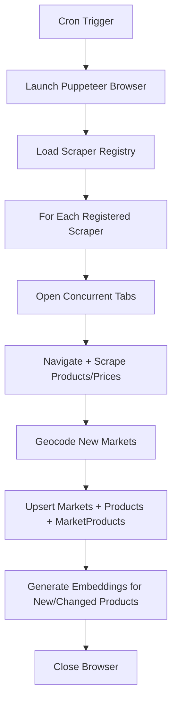

# Scraper Module

## Public Summary

Automated web scraping pipeline using Puppeteer with concurrent tabs, market discovery, price collection, geocoding, and post-scrape embedding generation. Runs on a twice-weekly cron schedule.

## Internal Details

### Files

| File | Role |
|------|------|
| `scraper.service.js` | Orchestrator: launches browser, dispatches scrapers |
| `scraper.cron.js` | Cron schedule definition |
| `scraper.registry.js` | Plugin registry for market scrapers |
| `geocoder.service.js` | Nominatim geocoding with caching |
| `vero.scraper.js` | Vero market scraper |
| `ramstore.scraper.js` | Ramstore scraper |
| `stokomak.scraper.js` | Stokomak scraper |
| `kam.scraper.js` | KAM scraper |
| `superkitgo.scraper.js` | SuperKitGo scraper |
| `kipper.scraper.js` | Kipper scraper |
| `utils/` | Shared scraping utilities |

### Scripts

| Command | Description |
|---------|-------------|
| `npm run scrape` | Run all scrapers |
| `npm run scrape:<chain>` | Run a single chain scraper |
| `npm run scrape:db:wipe` | Wipe all scrape-related data |
| `npm run scrape:db:wipe:<chain>` | Wipe a single chain's data (markets, products, embeddings) |

### Cron Schedule

- **When**: Monday and Thursday at 03:00
- **Concurrency**: 2 tabs in production, 4 in development

### Pipeline



### Strategy + Registry Pattern

Each market scraper implements a common interface and registers itself in the scraper registry. The orchestrator iterates the registry without knowing scraper internals.

```js
// Each scraper exports: { name, scrape(page, deps) }
registry.register(veroScraper);
registry.register(ramstoreScraper);
// ...
```

### Geocoding

- **Primary**: Nominatim API lookup by market address.
- **Fallback**: City center coordinates if address lookup fails.
- **Caching**: Coordinates are cached to avoid redundant API calls.

### Performance Optimizations

- **Request interception**: blocks images, CSS, fonts during scraping.
- **Navigation timeout**: 90 seconds per page.
- **Batch processing**: concurrent tab pool limits resource usage.

### Dependencies

- Product, Market, MarketProduct modules (upsert data)
- Image module (market images)
- Search module (post-scrape embedding generation)
- Feature Flag module (conditional behavior)
- Geocoder service (Nominatim)

### Chain-Specific Wipe

The wipe script (`wipe-db-scrape-data.js`) supports two modes:

- **Full wipe** (`npm run scrape:db:wipe`): deletes all chains, markets, market_products, products, and product_embeddings.
- **Per-chain wipe** (`npm run scrape:db:wipe:<chain>`): deletes only the target chain's markets and market_products, removes orphaned products and embeddings not referenced by other chains, then deletes the chain record.

## Source Anchors

| Path | Relevance |
|------|-----------|
| `apps/server/src/modules/scraper/` | Service, cron, registry, geocoder, market scrapers |
| `apps/server/src/scripts/wipe-db-scrape-data.js` | Full and per-chain data wipe |

## Failure Modes

| Failure | Behavior |
|---------|----------|
| Scraper page timeout | Skip market, log error, continue |
| Geocoding failure | Use city center fallback |
| Embedding generation failure | Products saved without embeddings |
| Browser crash | Cron retries on next scheduled run |
