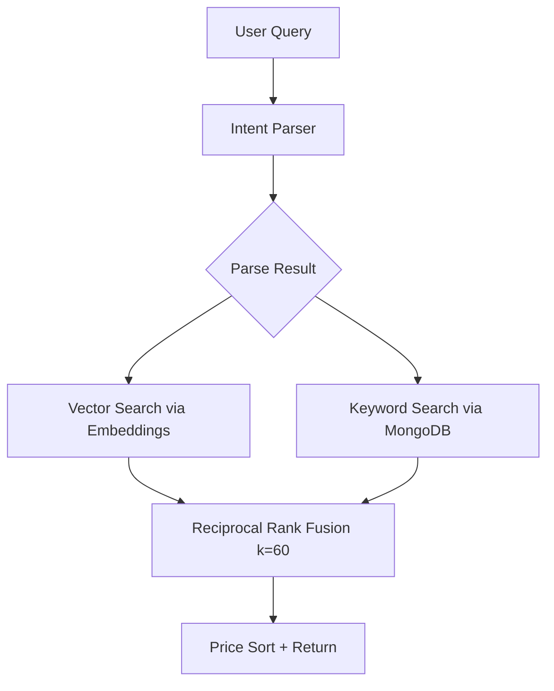
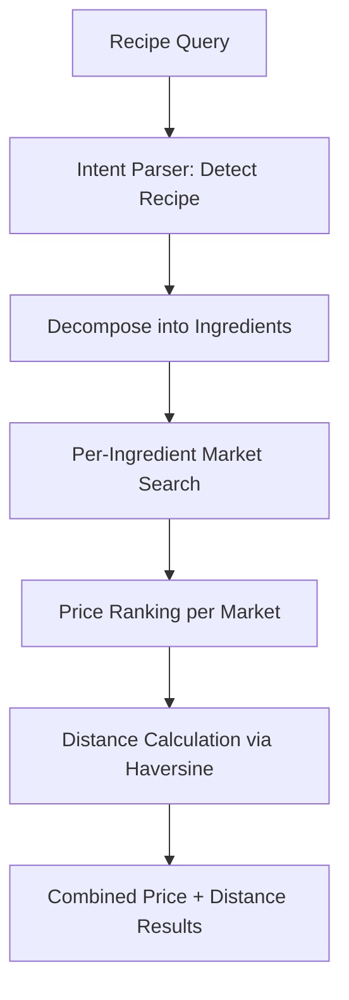

# Search Module

## Public Summary

Dual-mode AI-powered search: hybrid vector+keyword search for products and smart recipe-based search with geolocation and budget calculation.

## Internal Details

### Files

| File | Role |
|------|------|
| `search.controller.js` | Hybrid search HTTP handler |
| `search.service.js` | Hybrid search logic (vector + keyword + RRF) |
| `search.routes.js` | Search route definitions |
| `smart-search.controller.js` | Smart/recipe search HTTP handler |
| `smart-search.service.js` | Recipe decomposition + geolocation logic |
| `smart-search.routes.js` | Smart search route definitions |
| `embedding.service.js` | Gemini embedding generation |
| `product-embedding-sync.service.js` | Incremental embedding sync |
| `intent-parser.service.js` | Gemini intent/query parsing |
| `product-embedding.model.js` | Embedding vector storage |
| `product-embedding.repository.js` | Embedding data access |

### Hybrid Search (SearchService)

**Endpoint**: `GET /search?q=...&marketId=...`

1. **Intent parsing** via Gemini 2.5 Flash — detects search terms, price preference, language.
2. **Parallel execution** of vector search (cosine similarity on embeddings) and keyword search (MongoDB text/regex).
3. **RRF merge** with k=60 to combine ranked results.
4. **Market scoping** optimization when `marketId` is provided.

### Smart Search (SmartSearchService)

**Endpoints**:
- `GET /smart-search?q=...&lat=...&lon=...` — Recipe search with geolocation
- `GET /smart-search/budget` — Weekly budget calculation

### Embedding Service

- **Model**: Gemini 2 text embeddings (768 dimensions)
- **Batch processing**: rate-limited at 350ms between batches
- **Retry**: exponential backoff on API busy/rate-limit responses

### Intent Parser Service

- **Model**: Gemini 2.5 Flash
- **Bilingual**: Cyrillic + Latin Macedonian
- **Detects**: recipe vs. product search, price preference (asc/desc), ingredient decomposition
- **Cache**: 5-minute local cache, 500 entry max
- **Fallback**: model fallback strategy if primary unavailable

### Feature Flag Gates

| Flag | Controls |
|------|----------|
| `ai-search` | Enables hybrid vector+keyword search |
| `smart-search` | Enables recipe decomposition search |

When flags are disabled, search falls back to basic keyword-only behavior.

## Source Anchors

| Path | Relevance |
|------|-----------|
| `apps/server/src/modules/search/` | All search services, controllers, routes, models |

## Failure Modes

| Failure | Behavior |
|---------|----------|
| Gemini API unavailable | Graceful degradation to keyword-only search |
| Embedding generation fails | Products searchable via keyword only |
| Intent parsing fails | Raw query used as-is |
| Rate limit on embedding API | Exponential backoff retry |
