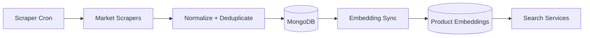

# Scraper And Search Pipeline

## Public Summary

The backend periodically scrapes market data, normalizes it, stores it in MongoDB, and can enrich products with embeddings for search features.

## Internal Details

### Pipeline

### Strategy + Registry Design

- Scrapers follow a shared base contract.
- A registry maps source names to concrete scraper implementations.
- The orchestrator executes multiple market scrapers in one run.

### Feature Flag Integration

- Search and embedding behavior can be gated by feature flags.
- This enables controlled rollout for AI-driven features.

## Source Anchors

| Path | Relevance |
|------|-----------|
| `apps/server/src/modules/scraper/markets/base.scraper.js` | Shared scraper contract |
| `apps/server/src/modules/scraper/scraper.registry.js` | Plugin registry |
| `apps/server/src/modules/scraper/scraper.service.js` | Orchestrator (Puppeteer + concurrent tabs) |
| `apps/server/src/modules/search/product-embedding-sync.service.js` | Incremental embedding sync |
| `apps/server/src/modules/search/search.service.js` | Hybrid search (vector + keyword + RRF) |
| `apps/server/src/modules/search/smart-search.service.js` | Recipe and budget-aware search |

## Risks and Trade-offs

- Upstream HTML changes can break scraper extraction logic.
- Embedding provider outages can degrade smart-search behavior.
