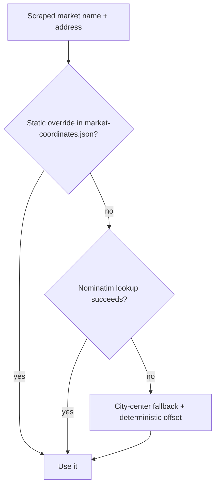

# Geolocation

## Public Summary

Every market Obrok scrapes needs a map coordinate, but none of the source websites reliably provide one. Turning a scraped store name like "КАМ Илинден" into a usable `[latitude, longitude]` pair is a three-tier pipeline, and it fails in specific, findable ways. This page explains the pipeline and walks through a real case where it had failed silently for a large share of two supermarket chains, and how that was found and corrected.

## Internal Details

### The Three-Tier Pipeline

1. **Static override** (`data/market-coordinates.json`) — a hand-maintained lookup keyed by normalized market name. This is checked first and lets a manually-verified coordinate permanently override whatever the automated tiers would produce.
2. **Nominatim lookup** — a free, self-hosted-friendly geocoding service (OpenStreetMap's) queried with the store's address, name, and transliterated variants.
3. **City-center fallback** — if every Nominatim query fails, the market is placed near a hardcoded city-center coordinate for its city, offset by 80–250m in a direction derived from a hash of the market's name, so that several failed lookups in the same city don't all land on the exact same pixel.

That third tier exists because a market with *no* coordinate is worse than one with an approximate coordinate: search ranking and route suggestions both depend on every market having *some* location. The trade-off is that a fallback coordinate can look plausible (it's in the right city) while being wrong by kilometers, and nothing in the pipeline flags it as low-confidence downstream.

### A Case Study: Finding and Fixing Real Drift

While auditing coordinates for two chains scraped by this pipeline, KAM and Stokomak, both showed the failure mode above in practice.

**KAM.** KAM's own store-list API turned out to already return a precise `Coordinates` field per shop, the scraper (`kam.scraper.js`) simply never read it, forwarding only name, address, and price-list URL. Comparing the stored coordinates against that field directly: of KAM's ~86 branches, 11 had fallen through to the city-center fallback, in one case (a Skopje branch on Џон Кенеди) off by over a kilometer, and several small-town branches off by up to 15km. Fix: read the chain's own coordinate field instead of relying on Nominatim for a source that already provides ground truth.

**Stokomak.** Unlike KAM, Stokomak's site gives no address or coordinate at all, just a bare neighborhood name in a dropdown (e.g. "СЕВЕР", "КАРПОШ 2"). There's no ground truth to diff against from the source itself. Cross-referencing each Skopje-neighborhood name against OpenStreetMap's own administrative boundary data found 10 branches placed in the wrong neighborhood entirely, one ("Козле") was 28.7km outside Skopje, not a fallback-radius miss but a wrong-place-altogether error.

**A second, distinct bug** surfaced alongside this: two Stokomak branches both named "Чаир" and "Чаир 2" had bit-for-bit identical stored coordinates, evidence one was copy-pasted rather than independently geocoded. A business directory listing gave a confirmed address for the first branch; no independent listing could be found for the second, so it was separated from the first by the same deterministic offset the fallback tier uses, an honest approximation, not a verified fix.

### A Related, Unfixed Limitation

KAM's own API lists three different branches all named plain "Велес" at three different addresses. The scraper's name-based deduplication keeps only the first and silently drops the other two, so two real branches never enter the database at all. This isn't a coordinate bug, it's a data-modeling gap (the source doesn't guarantee unique names), and fixing it would mean changing how the scraper identifies a market, not just correcting a coordinate.

### Why This Matters Beyond the Map Pin

A market's coordinate feeds two other systems directly: [recipe search](/concepts/search-and-recipes) uses it to rank markets by distance, and the [map's routing feature](/concepts/routing-and-map) uses it as a route endpoint. A wrong coordinate doesn't just misplace a pin, it can rank a market as the "nearest complete match" when it isn't, or route a user to the wrong building entirely.

## Source Anchors

| Path | Relevance |
|------|-----------|
| `apps/server/src/modules/scraper/geocoder.service.js` | Three-tier geocoding implementation |
| `apps/server/src/data/market-coordinates.json` | Static override tier |
| `apps/server/src/scripts/seed-coordinates.js` | Migration script that pushes JSON corrections into MongoDB |
| `apps/server/src/modules/scraper/markets/kam.scraper.js` | Chain scraper that discards an available ground-truth coordinate field |
| `apps/server/src/modules/scraper/markets/base.scraper.js` | Name-based deduplication (source of the Велес gap) |
| [Scraper Module reference](/backend/modules/scraper) | Full pipeline detail |
| [Market Module reference](/backend/modules/market) | Coordinate storage format |

## Risks and Trade-offs

- The static override tier requires someone to notice and manually fix bad coordinates; there's no automated check that flags a market as fallback-derived versus verified.
- Chain-provided coordinates (when available, as with KAM) are trusted as-is; the pipeline has no cross-validation against a second source.
- The deterministic hash-offset used for both the city-center fallback and for separating same-named sibling branches produces similar offsets for names differing only in a trailing digit (e.g. "1" vs "2"), because the hash mixes characters left-to-right and a single trailing digit barely changes the accumulated value. Branch pairs can end up only a few meters apart instead of clearly separated.
