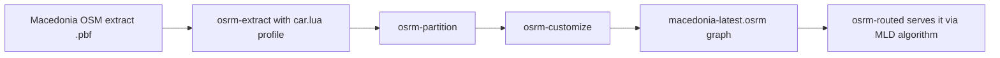

# Routing & Map

## Public Summary

The map renders every scraped market as a pin, clusters them when there are too many to show individually, and can draw a walking, cycling, or driving route from the user's location to a chosen market. Routes are computed by OSRM, a self-hosted, open-source routing engine, rather than a paid third-party directions API.

## Internal Details

### Why Self-Hosted Routing

Commercial routing APIs (Google Directions, Mapbox Directions) charge per request and require an external API key and network dependency for every route the app draws. OSRM is open-source and can be run entirely inside the project's own Docker Compose stack against a single country's map data, no per-request cost, no external API key, and it keeps working if the third-party service the app otherwise depends on (Gemini, for search) is unavailable.

### How the Routing Data Is Prepared

OSRM doesn't route against raw map data directly; it needs a preprocessed graph, built once, offline, from an OpenStreetMap extract:



This is a one-time (or occasional) offline step, not something that runs per-request. The resulting graph is what `osrm-routed` serves at query time.

### A Real Limitation: One Profile Serves Three Modes

The app exposes three travel modes, walking, cycling, driving, each with its own line color and dash pattern on the map, and each requests a different URL path from OSRM (`/foot/...`, `/bicycle/...`, `/car/...`). This matters because OSRM's routing behavior (which roads are usable, one-way restrictions, relative speeds) is determined by which Lua profile script was used at `osrm-extract` time, not by the URL path segment at request time. The data preparation step above only ever runs `car.lua`. In practice, this means "walking" and "cycling" routes are drawn using the same car-optimized road graph as driving, not routes computed against pedestrian- or bicycle-specific rules (e.g. taking a footpath a car couldn't use). The three modes are visually and functionally distinct in the UI, but not in the underlying route computation.

### Request Flow

```mermaid
sequenceDiagram
  participant U as User
  participant M as MapPage
  participant R as RoutingEngine
  participant O as OSRM
  U->>M: Selects a market and a travel mode
  M->>R: start/end coordinates + mode
  R->>O: GET /{profile}/{start};{end}?overview=full&geometries=geojson
  O-->>R: Route geometry (GeoJSON LineString)
  R-->>M: Render as a styled line, fit map bounds to it
```

### Rendering Hundreds of Markets

The map uses MapLibre GL (an open-source fork of Mapbox GL) via `react-map-gl`, with market pins grouped by **Supercluster** at lower zoom levels. Clustering avoids rendering hundreds of overlapping DOM/WebGL markers at once; as the user zooms in, clusters expand into individual pins. This is a client-side performance optimization, not a data-quality feature, a cluster's visual position is just the centroid of the markers inside it.

## Source Anchors

| Path | Relevance |
|------|-----------|
| `init-route-data.sh` | OSRM data preparation pipeline (`car.lua` only) |
| `docker-compose.dev.yml`, `docker-compose.prod.yml` | OSRM service definition (`osrm-routed --algorithm mld`) |
| `apps/client/src/features/map/components/RoutingEngine.jsx` | Route request/render logic, per-mode styling |
| `apps/client/src/features/map/components/MarketMarkers.jsx` | Supercluster configuration |
| [Map Feature reference](/frontend/features/map) | Full component breakdown |
| [Map And UX Flows](/frontend/map-flows) | Additional interaction flows |

## Risks and Trade-offs

- Walking/cycling routes are not computed against mode-specific road rules (see above); presenting them as distinct travel modes is a UI-level claim the routing backend doesn't fully back.
- Routing data is only as current as the last OSM extract; road changes since then won't be reflected until the extract/partition/customize pipeline is re-run manually.
- Route quality and pin placement both depend on upstream data correctness: OSM's road graph for routing, and Obrok's own [geocoding pipeline](/concepts/geolocation) for where the endpoint markers actually are.
