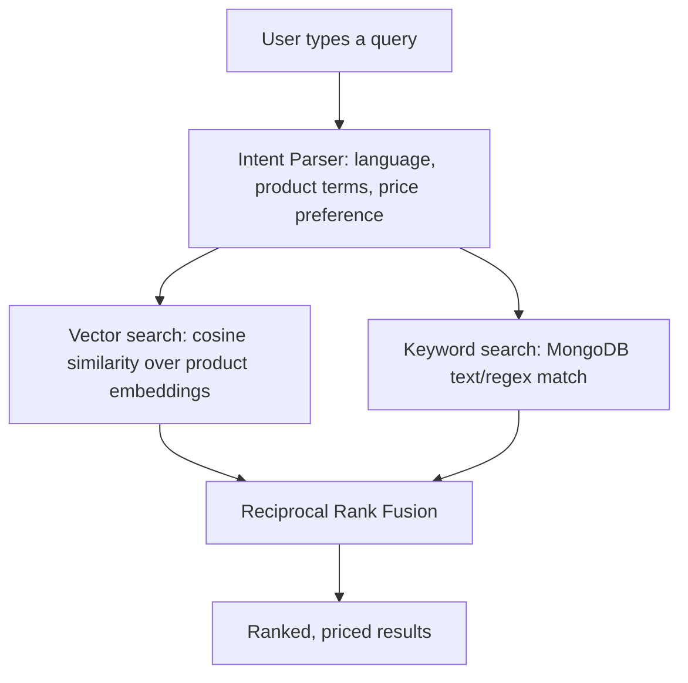
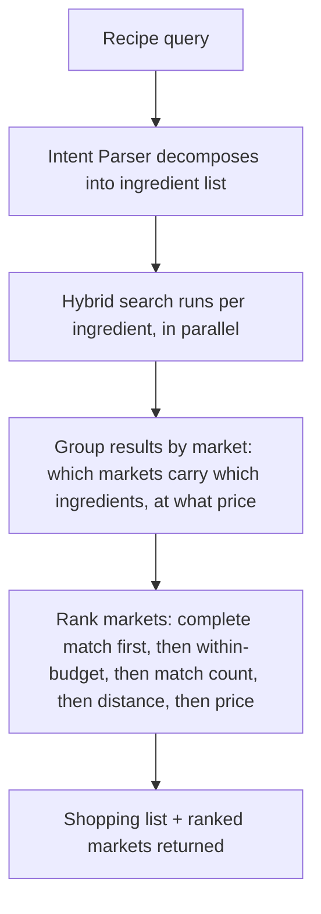

# Search & Recipe Decomposition

## Public Summary

Obrok answers two different kinds of questions with two different search paths: "where is milk cheapest" (hybrid product search) and "I want to cook tavče gravče this week, where should I shop" (recipe search). Both start from the same free-text box; an AI intent-parsing step decides which path a query takes.

## Internal Details

### Why Not Just Keyword Search

A pure keyword search fails on typos, synonyms, and bilingual input (Macedonian is written in both Cyrillic and Latin script, sometimes in the same session). A pure vector (embedding) search fixes those but is worse at exact-match queries like a specific brand name. Obrok runs both and merges the results, so a query benefits from whichever method scores it better.

**Embeddings** are numeric vectors that place semantically similar text near each other in space, e.g. "тепсиско млеко" and "milk" end up close together even though they share no characters. Every product's title/description is embedded once (and re-embedded only when its text changes, via an incremental sync job); a query is embedded the same way at search time, and the two are compared by cosine similarity.

**Reciprocal Rank Fusion (RRF)** is the merge step: instead of trying to make vector-similarity scores and keyword-match scores comparable (they're on different scales), RRF just uses each method's *rank position* for a product and combines `1 / (k + rank)` across both lists. A product that ranks well in either method surfaces near the top, without needing to calibrate the two scoring systems against each other.

### Recipe Decomposition

When the intent parser classifies a query as a recipe (e.g. "тавче гравче за 4 луѓе") rather than a product lookup, the flow changes:

The ingredient list itself is whatever the language model returns, there is no structured recipe database behind it. This is a deliberate trade-off: it works for arbitrary dishes without needing anyone to curate a recipe corpus, at the cost of decomposition quality being only as good as the model's output for that particular dish and phrasing.

### The Budget Angle

Every recipe search is scored against a weekly budget: 140 MKD/day for each working day (Monday–Saturday) in the current week, adjusted for public holidays, this is the statutory daily meal allowance in North Macedonia and the reason the app is named Obrok. A market is flagged `withinBudget` if the full ingredient list costs less than that weekly figure, and results are sorted with complete, within-budget matches first.

### Distance

Once markets are ranked by price completeness, straight-line (haversine) distance from the user's location breaks ties, this is where [geolocation](/concepts/geolocation) accuracy directly affects search quality: a market with wrong coordinates can be mis-ranked as closer or farther than it really is.

## Source Anchors

| Path | Relevance |
|------|-----------|
| `apps/server/src/modules/search/search.service.js` | Hybrid search + RRF merge |
| `apps/server/src/modules/search/smart-search.service.js` | Recipe decomposition, market ranking, budget logic |
| `apps/server/src/modules/search/intent-parser.service.js` | Query classification and ingredient decomposition |
| `apps/server/src/modules/search/embedding.service.js` | Embedding generation |
| `apps/server/src/shared/utils/obrokBudget.js` | Weekly budget calculation |
| `apps/server/src/shared/utils/haversine.js` | Distance calculation |
| [Search Module reference](/backend/modules/search) | Full endpoint/file breakdown |

## Risks and Trade-offs

- Both search paths depend on a third-party LLM provider being available; both degrade to keyword-only search or a raw-query pass-through if it isn't, rather than failing outright.
- Recipe decomposition quality is bounded by the model's judgment for a given dish and phrasing, there is no way to verify an ingredient list is "correct" the way a curated recipe database would guarantee.
- RRF's `k=60` constant and the embedding model's dimensionality (768) are tuning choices, not values derived from an evaluation against labeled relevance data.
