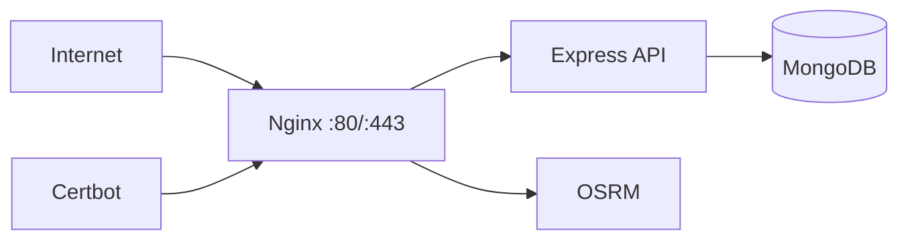

# Production Environment

## Public Summary

Production uses Nginx as the public entrypoint, proxies API and routing services internally, and relies on Certbot for TLS certificate automation.

## Internal Details

### Current Runtime Topology

### Deployment Path

- Release tag triggers test + VPS deploy workflow.
- VPS checks out release tag and rebuilds production compose services.
- Frontend release version is injected into apps/client/.env during deploy.

### docs.obrok.net Target

Recommended production model for docs:

1. Build VitePress static output from apps/docs/.vitepress/dist.
2. Serve through dedicated Nginx server_name docs.obrok.net.
3. Use static try_files suitable for VitePress, not SPA index fallback.

## Source Anchors

| Path | Relevance |
|------|-----------|
| `docker-compose.prod.yml` | Production service topology |
| `apps/nginx/nginx.conf` | Reverse proxy, SSL, static serving |
| `.github/workflows/deploy.yml` | Release-triggered deployment |
| `init-ssl.sh` | First-time SSL bootstrap |

## Risks and Trade-offs

- App and docs on same VPS is operationally simple but increases blast radius during host-level incidents.
