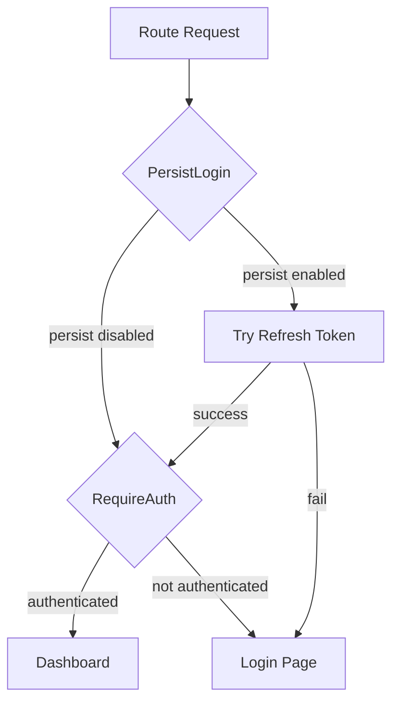

# Auth Feature

## Public Summary

Handles login, session persistence, token refresh, and route protection on the client side.

## Internal Details

### Files

| File | Role |
|------|------|
| `Login.jsx` | Login page with form |
| `PersistLogin.jsx` | Wrapper that refreshes tokens on app load |
| `RequireAuth.jsx` | Route guard — redirects to login if unauthenticated |
| `useAuth.js` | Hook to access auth state |
| `useLogout.js` | Hook to clear session |
| `useRefreshToken.js` | Hook to silently refresh access token |

### State Management

- **`authStore`** (Zustand, persisted to localStorage): stores `auth` object and `persist` flag.
- Access token kept in memory; refresh token in httpOnly cookie.

### Route Protection Flow

### Dependencies

| Dependency | Usage |
|------------|-------|
| `authStore` | Auth state persistence |
| `useAxiosPrivate` | Attach access token to API calls |
| Axios | `/login`, `/logout` API calls |

## Source Anchors

| Path | Relevance |
|------|-----------|
| `apps/client/src/features/auth/` | Login page, guards, auth hooks |
| `apps/client/src/store/authStore.js` | Auth state (Zustand, persisted) |
| `apps/client/src/hooks/useAxiosPrivate.js` | Token interceptor with 403 retry |
