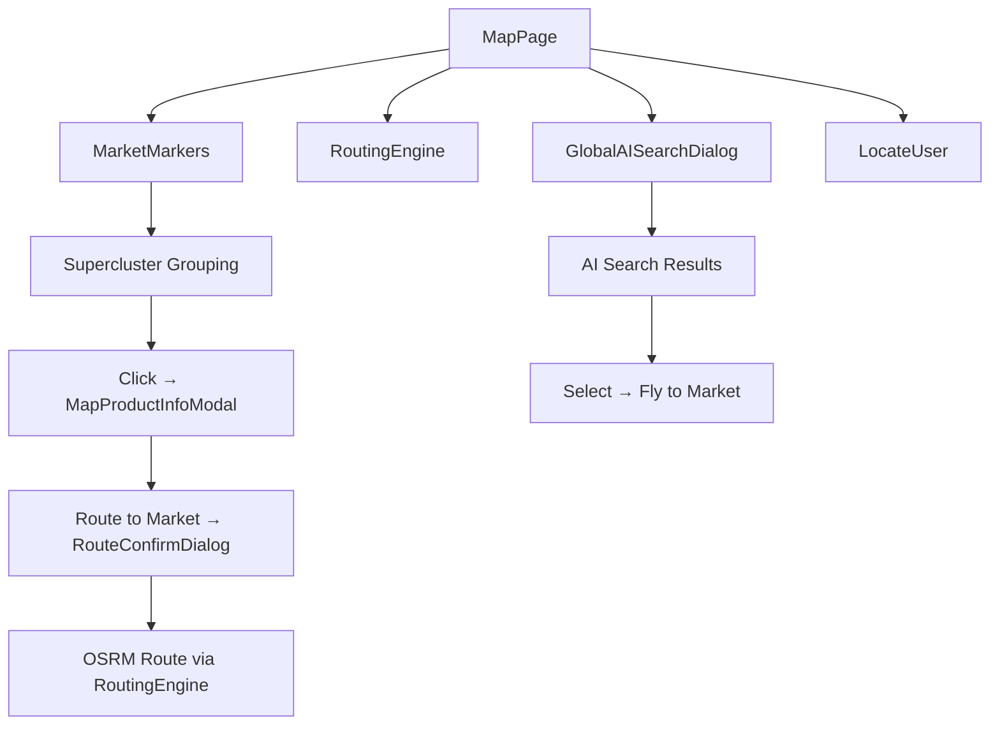

# Map Feature

## Public Summary

Interactive MapLibre-based map showing supermarket locations, product search, multi-modal routing (walk, bike, car), market clustering, and AI-powered search dialog.

## Internal Details

### Files

| File | Role |
|------|------|
| `MapPage.jsx` | Main map page with all controls |
| `RoutingEngine.jsx` | OSRM route rendering |
| `MarketMarkers.jsx` | Market pins with clustering |
| `CreditMarker.jsx` | Map attribution |
| `GlobalAISearchDialog.jsx` | AI-powered search overlay |
| `RouteConfirmDialog.jsx` | Route mode selection dialog |
| `LocateUser.jsx` | Geolocation button |
| `UserDot.jsx` | User position indicator |
| `MapProductInfoModal.jsx` | Market product detail modal |
| `useMapPitch.js` | 3D pitch interaction hook |
| `markerUtils.js` | Marker helper utilities |
| `defaultVisibleChains.js` | Default chain filter config |
| `markerColors.js` | Chain color mapping |
| `markerPaths.js` | SVG marker path definitions |

### Key Interactions

### Clustering

Uses **Supercluster** to group nearby markets at lower zoom levels, expanding to individual markers on zoom in. Performance optimization for hundreds of market locations.

### Routing

- **OSRM backend** at `/route/` for path calculation.
- Three modes: walking, cycling, driving.
- Route rendered as styled polyline on map.
- Route confirmation dialog lets user pick mode before rendering.

### Chain Filters

- Users can toggle chain visibility (e.g., show only Vero markets).
- Filter state persisted to `localStorage`.
- Default visible chains configured in `defaultVisibleChains.js`.

### Feature Flag Integration

- `ai-search` flag gates the `GlobalAISearchDialog` component.
- When disabled, only basic map browsing is available.

### Dependencies

| Dependency | Usage |
|------------|-------|
| MapLibre GL / react-map-gl | Map rendering |
| Supercluster | Marker clustering |
| OSRM | Routing engine |
| `themeStore` | Dark/light map style |
| `featureFlagStore` | AI search gate |
| `useAuth` / `useLogout` | Auth state in header |

## Source Anchors

| Path | Relevance |
|------|-----------|
| `apps/client/src/features/map/` | Pages, components, hooks, config, utils |
