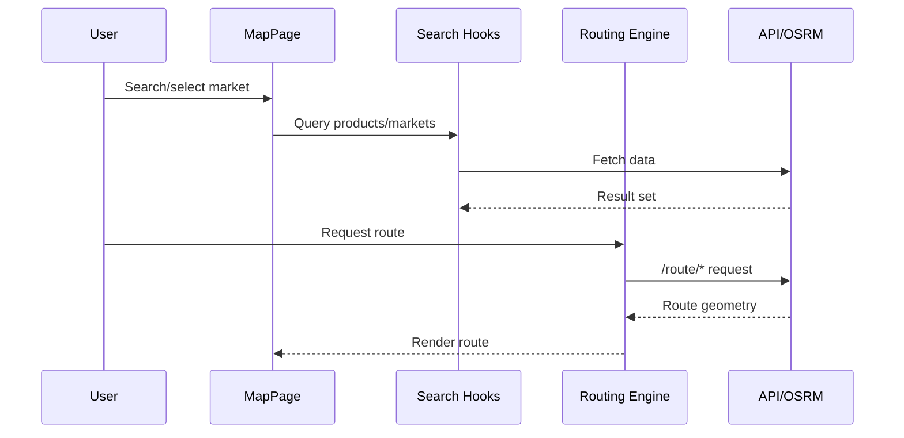

# Map And UX Flows

## Public Summary

Map experience combines market visualization, AI-assisted search, and route planning through OSRM-backed interactions.

## Internal Details

### Map Flow

### Interaction Patterns

- Clustered markers and responsive map behavior.
- Modal-driven AI search entry.
- Route confirmation workflow before navigation actions.

## Source Anchors

| Path | Relevance |
|------|-----------|
| `apps/client/src/features/map/pages/MapPage.jsx` | Main map page |
| `apps/client/src/features/map/components/` | Map UI components (markers, routing, search) |
| `apps/client/src/features/map/hooks/` | Map interaction hooks |
| `apps/client/src/features/map/components/RoutingEngine.jsx` | OSRM route rendering component |

## Risks and Trade-offs

- Map-heavy pages can accumulate complexity quickly; keep feature boundaries strict and isolate routing/search concerns in hooks/services.
