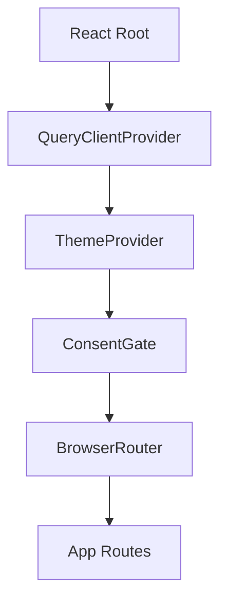

# Frontend Overview

## Public Summary

The frontend is a React + Vite SPA organized by features, with route guards for protected areas and a combination of Zustand and TanStack Query for state.

## Internal Details

### Provider Composition

### Organization

- Feature folders group pages, components, and hooks by domain.
- Shared cross-cutting concerns are in hooks, store, and theme.

## Source Anchors

| Path | Relevance |
|------|-----------|
| `apps/client/src/entry.jsx` | Provider composition chain |
| `apps/client/src/components/layout/App.jsx` | Route tree and guards |
| `apps/client/src/features/` | Feature-based module directories |
| `apps/client/src/store/` | Zustand stores (auth, theme, flags) |
| `apps/client/src/hooks/` | Shared hooks (axios, debounce, feature flag) |

## Risks and Trade-offs

- Feature-first organization scales well for ownership, but requires consistency in naming and query key conventions.
