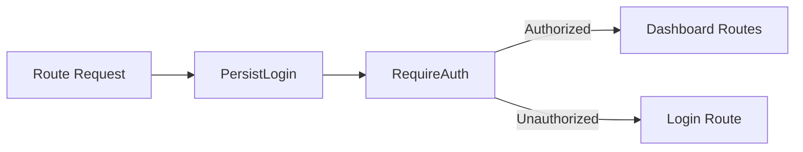

# Routing And Access Control

## Public Summary

Routing separates public and protected areas. Access to dashboard routes is enforced by authentication wrappers.

## Internal Details

### Route Model

- Public: landing/map and login.
- Protected: dashboard feature routes behind auth guards.

### Access Flow

### Auth Recovery Behavior

- Axios interceptor attempts token refresh on 403.
- Guard components keep protected UI unavailable when auth is invalid.

## Source Anchors

| Path | Relevance |
|------|-----------|
| `apps/client/src/components/layout/App.jsx` | Route definitions |
| `apps/client/src/features/auth/components/PersistLogin.jsx` | Silent token refresh wrapper |
| `apps/client/src/features/auth/components/RequireAuth.jsx` | Auth guard for dashboard routes |
| `apps/client/src/hooks/useAxiosPrivate.js` | Token interceptor with 403 retry |

## Risks and Trade-offs

- Auth coupling between guards and interceptor behavior requires clear testing to avoid redirect loops.
