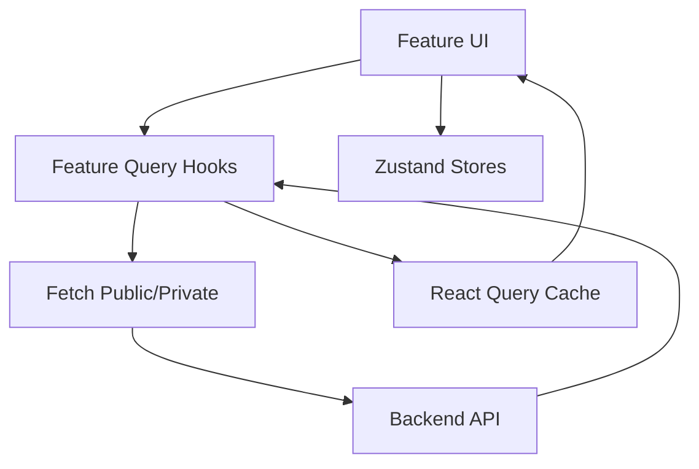

# State And Server Data

## Public Summary

The frontend separates local/client state (Zustand) from server state (TanStack Query), which keeps network caching and UI state concerns distinct.

## Internal Details

### State Responsibilities

- Zustand: auth state, theme preferences, feature flag snapshots.
- React Query: API data fetching, cache invalidation, and mutation lifecycle.

### Data Flow

### Query Conventions

- Query key factories are defined by feature.
- Mutations invalidate domain and dependent keys.
- Conditional queries use enabled predicates.

## Source Anchors

| Path | Relevance |
|------|-----------|
| `apps/client/src/store/authStore.js` | Auth state (Zustand, persisted) |
| `apps/client/src/store/themeStore.js` | Theme preference (Zustand, persisted) |
| `apps/client/src/store/featureFlagStore.js` | Feature flag cache (Zustand) |
| `apps/client/src/features/products/hooks/useProductQueries.js` | Example query key factory |
| `apps/client/src/features/chains/hooks/useChainQueries.js` | Example query key factory |
| `apps/client/src/api/fetch.js` | Fetch wrappers with auth retry |

## Risks and Trade-offs

- Cache invalidation strategy is explicit but can become repetitive across features without shared utility helpers.
